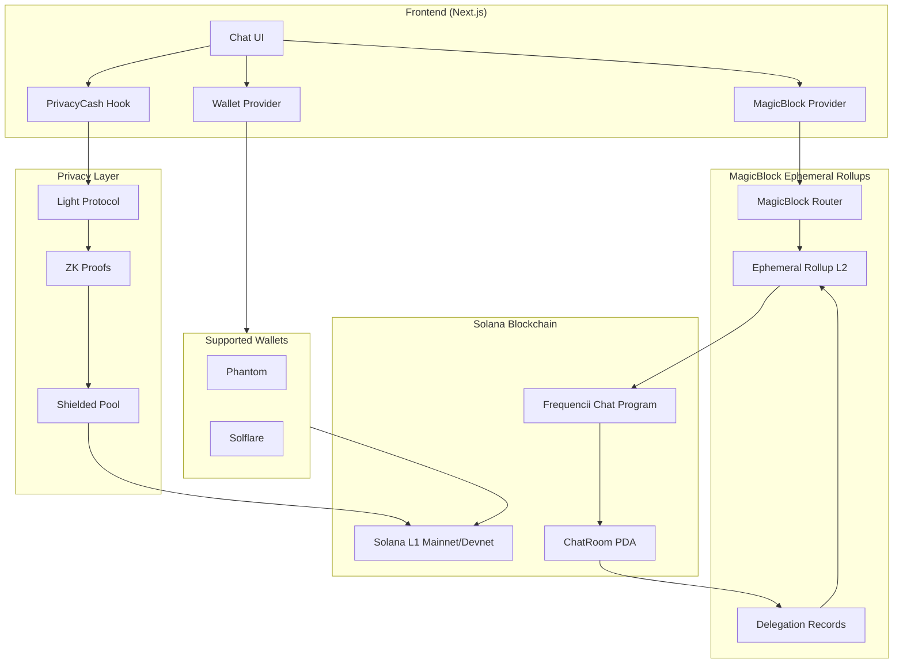
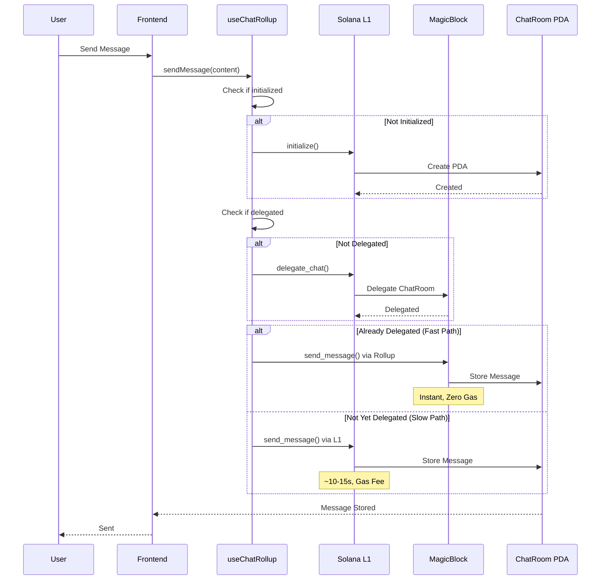
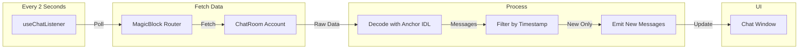
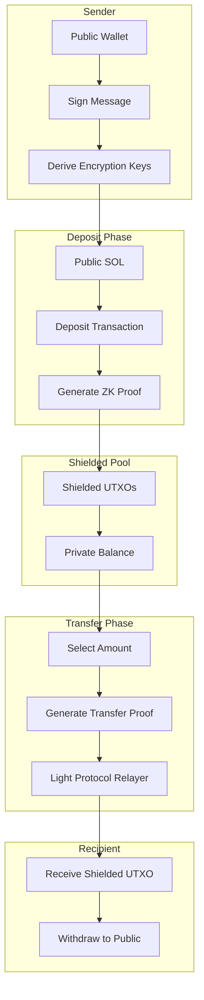
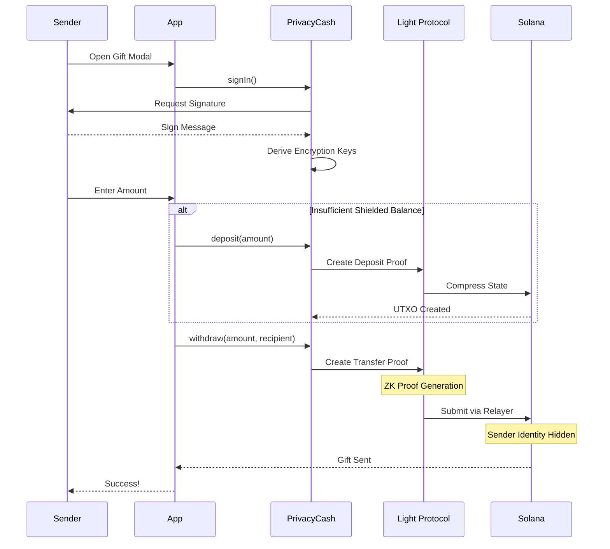
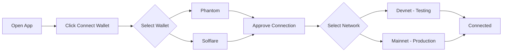
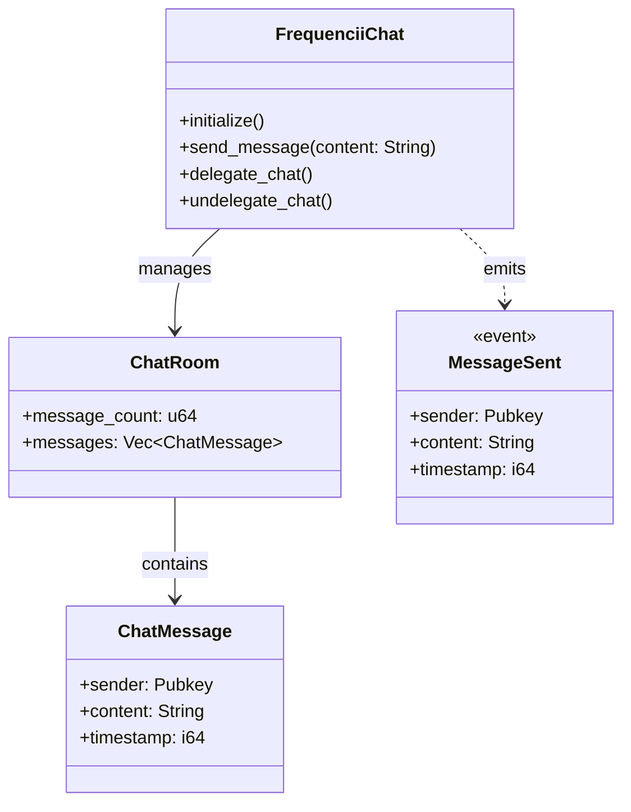
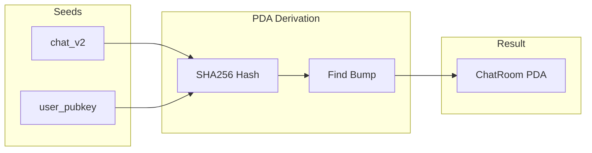
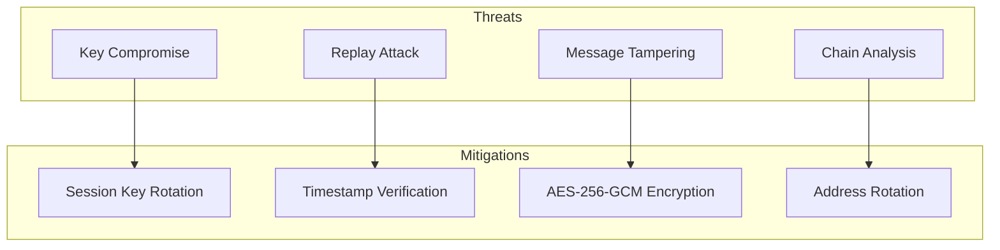

# Frequencii World - Architecture

## Overview

**Frequencii World** is a privacy-focused Web3 social application built on Solana blockchain. This application combines:

- **Real-time P2P Chat** - Instant messaging with high speed and zero gas fees
- **Private Gifts** - Anonymous transfers using Zero-Knowledge Proofs

---

## System Architecture

### High-Level Architecture



---

## P2P Chat Flow

### Chat Message Flow Diagram



### Chat Listener Flow



---

## Private Gift Flow

### Shielded Transfer Architecture



### Private Gift Sequence



---

## User Guide

### 1. Wallet Connection



### 2. Sending Messages

| Step | Action | Description |
|------|--------|-------------|
| 1 | **Add Contact** | Click "Add Contact" - Enter Solana address |
| 2 | **Select Contact** | Choose a contact from the sidebar |
| 3 | **Type Message** | Type your message in the input field |
| 4 | **Send** | Click Send or press Enter |

> **Note**: The first message requires on-chain initialization (~10-15 seconds). After that, messages will be instant!

### 3. Sending Private Gifts

| Step | Action | Description |
|------|--------|-------------|
| 1 | **Sign In** | Click "Sign In" to generate encryption keys |
| 2 | **Check Balance** | View your shielded balance |
| 3 | **Deposit (Optional)** | Deposit SOL to the shielded pool if needed |
| 4 | **Select Recipient** | Choose the contact to receive the gift |
| 5 | **Enter Amount** | Enter the SOL amount |
| 6 | **Confirm** | Confirm the transaction |

> **Privacy**: Sender identity is hidden from the recipient!

---

## Smart Contract Architecture

### Program Structure



### PDA Derivation



---

## Development

### Quick Start

```bash
# Install dependencies
npm install

# Run development server
npm run dev

# Build for production
npm run build

# Start production server
npm run start
```

### Environment Variables

```env
# Required
NEXT_PUBLIC_REOWN_PROJECT_ID=your_project_id

# Optional - Custom RPC
NEXT_PUBLIC_HELIUS_RPC_URL=https://your-helius-rpc.com
```

### Project Structure

```
frequencii/
├── src/
│   ├── app/(main)/
│   │   └── chat/
│   │       ├── page.tsx              # Main chat UI
│   │       ├── components/           # Chat components
│   │       └── hooks/
│   │           ├── useChatRollup.ts  # MagicBlock integration
│   │           ├── usePrivacyCash.ts # Privacy layer
│   │           └── useChatListener.ts # Message polling
│   ├── components/
│   │   ├── WalletProvider.tsx        # Wallet setup
│   │   └── MagicBlockProvider.tsx    # Rollup provider
│   └── utils/
│       └── frequencii_chat.json      # Anchor IDL
├── contracts/
│   └── frequencii_chat/
│       └── programs/
│           └── frequencii_chat/
│               └── src/lib.rs        # Smart contract
└── HOW_TO_USE.md                     # This file
```

---

## Technical Specifications

### Performance

| Metric | Via MagicBlock | Via Solana L1 |
|--------|---------------|---------------|
| **Latency** | < 1 second | 10-15 seconds |
| **Gas Cost** | FREE | ~5000-10000 lamports |
| **Throughput** | 1000+ msg/sec | ~400 TPS |

### Privacy Features

| Feature | Technology | Guarantee |
|---------|------------|-----------|
| **Sender Anonymity** | Light Protocol ZK | Identity hidden |
| **Transaction Unlinkability** | UTXO Model | No chain analysis |
| **Amount Privacy** | Encrypted | Hidden from public |

### Limitations

| Limitation | Description |
|------------|-------------|
| **Message Storage** | Max 20 messages per chat room |
| **Message Size** | Max 256 bytes per message |
| **Minimum Gift** | 0.01 SOL |
| **Gift Fee** | ~0.5-1% + ~0.007 SOL withdrawal |

---

## Security Considerations



---

## Additional Resources

- **Solana Docs**: https://solana.com/docs
- **MagicBlock**: https://magicblock.gg
- **Light Protocol**: https://lightprotocol.com
- **Anchor Framework**: https://anchor-lang.com

---

## License

This project is built for the Solana ecosystem competition.

---

*Built on Solana*
