# Frequencii — Architecture

## Overview

Frequencii is a **privacy-first AI prediction market agent** on Solana. The core architectural challenge it solves: **how do you trade prediction markets without anyone knowing it's you?**

On platforms like Polymarket, every position is permanently linked to your wallet. Chain analysts, competitors, and adversaries can track your bets, reverse-engineer your strategy, and front-run your positions. Frequencii eliminates this by routing all prediction trades through ZK-shielded ephemeral wallets — making your identity, positions, and strategy invisible.

---

## System Architecture

### High-Level Overview

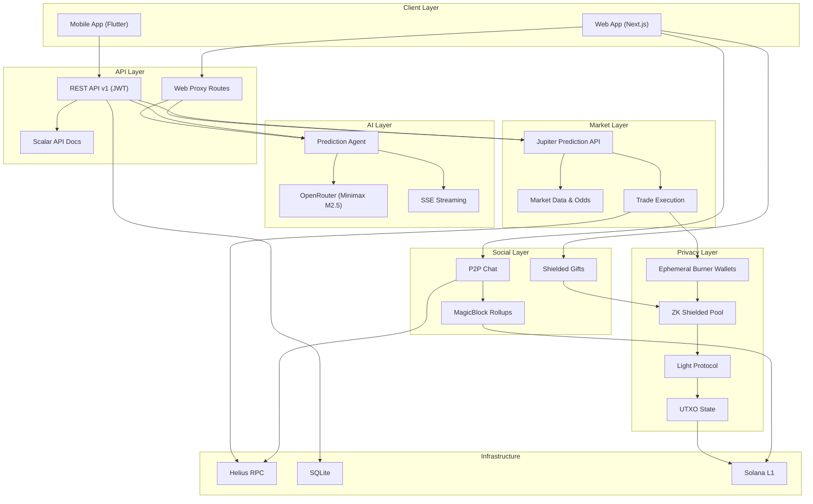
```mermaid
flowchart TB
    subgraph Client["Client Layer"]
        Web["Web App (Next.js)"]
        Mobile["Mobile App (Flutter)"]
    end

    subgraph API["API Layer"]
        WebProxy["Web Proxy Routes"]
        V1["REST API v1 (JWT)"]
        Docs["Scalar API Docs"]
    end

    subgraph Intelligence["AI Layer"]
        Agent["Prediction Agent"]
        LLM["OpenRouter (Minimax M2.5)"]
        Stream["SSE Streaming"]
    end

    subgraph Markets["Market Layer"]
        Jupiter["Jupiter Prediction API"]
        MarketData["Market Data & Odds"]
        Trading["Trade Execution"]
    end

    subgraph Privacy["Privacy Layer"]
        ZKPool["ZK Shielded Pool"]
        Light["Light Protocol"]
        Burner["Ephemeral Burner Wallets"]
        UTXO["UTXO State"]
    end

    subgraph Social["Social Layer"]
        Chat["P2P Chat"]
        MagicBlock["MagicBlock Rollups"]
        Gifts["Shielded Gifts"]
    end

    subgraph Infra["Infrastructure"]
        Helius["Helius RPC"]
        SQLite["SQLite"]
        Solana["Solana L1"]
    end

    Web --> WebProxy
    Mobile --> V1
    V1 --> Docs

    WebProxy --> Agent
    V1 --> Agent
    Agent --> LLM
    Agent --> Stream

    WebProxy --> Jupiter
    V1 --> Jupiter
    Jupiter --> MarketData
    Jupiter --> Trading

    Trading --> Burner
    Burner --> ZKPool
    ZKPool --> Light
    Light --> UTXO
    UTXO --> Solana

    Web --> Chat
    Chat --> MagicBlock
    MagicBlock --> Solana

    Web --> Gifts
    Gifts --> ZKPool

    V1 --> SQLite
    Trading --> Helius
    Chat --> Helius
```

---

## Privacy Architecture — The Core

### The Polymarket Problem

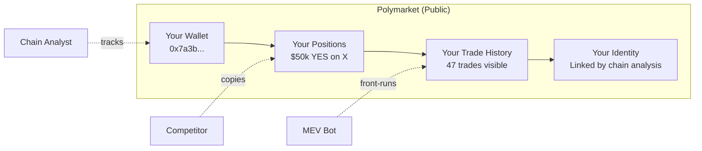
```mermaid
flowchart LR
    subgraph Polymarket["Polymarket (Public)"]
        PW["Your Wallet\n0x7a3b..."]
        PP["Your Positions\n$50k YES on X"]
        PT["Your Trade History\n47 trades visible"]
        PI["Your Identity\nLinked by chain analysis"]
    end

    PW --> PP
    PP --> PT
    PT --> PI

    Analyst["Chain Analyst"] -.->|"tracks"| PW
    Competitor["Competitor"] -.->|"copies"| PP
    MEV["MEV Bot"] -.->|"front-runs"| PT
```

### The Frequencii Solution

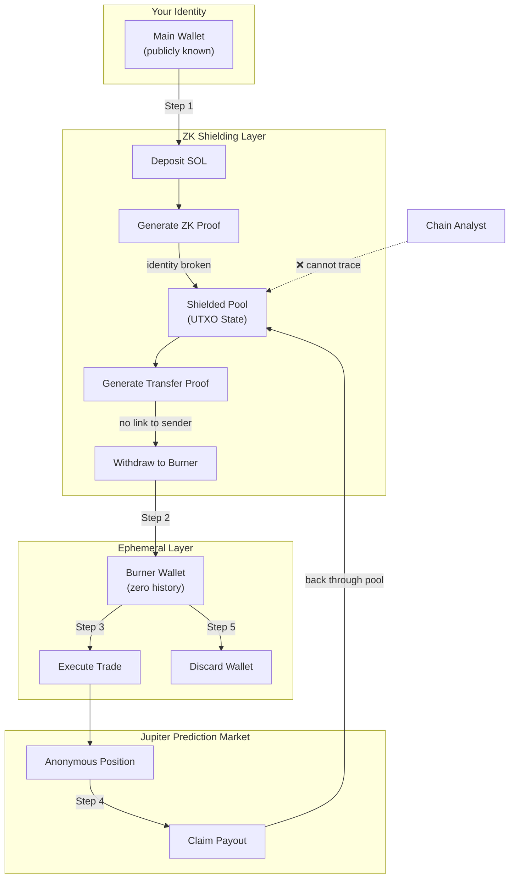
```mermaid
flowchart TB
    subgraph Identity["Your Identity"]
        MainWallet["Main Wallet\n(publicly known)"]
    end

    subgraph Shielding["ZK Shielding Layer"]
        Deposit["Deposit SOL"]
        ZKProof1["Generate ZK Proof"]
        Pool["Shielded Pool\n(UTXO State)"]
        ZKProof2["Generate Transfer Proof"]
        Withdraw["Withdraw to Burner"]
    end

    subgraph Ephemeral["Ephemeral Layer"]
        Burner["Burner Wallet\n(zero history)"]
        Trade["Execute Trade"]
        Discard["Discard Wallet"]
    end

    subgraph Market["Jupiter Prediction Market"]
        Position["Anonymous Position"]
        Payout["Claim Payout"]
    end

    MainWallet -->|"Step 1"| Deposit
    Deposit --> ZKProof1
    ZKProof1 -->|"identity broken"| Pool
    Pool --> ZKProof2
    ZKProof2 -->|"no link to sender"| Withdraw
    Withdraw -->|"Step 2"| Burner
    Burner -->|"Step 3"| Trade
    Trade --> Position
    Position -->|"Step 4"| Payout
    Payout -->|"back through pool"| Pool
    Burner -->|"Step 5"| Discard

    Analyst["Chain Analyst"] -.->|"❌ cannot trace"| Pool
```

### Privacy Guarantee Matrix

| Attack Vector | How Polymarket Fails | How Frequencii Protects |
| :--- | :--- | :--- |
| **Wallet tracking** | All positions linked to one address | Each trade uses fresh burner wallet |
| **Chain analysis** | Deposit → trade → withdrawal is traceable | ZK proofs break the deposit-withdrawal link |
| **Position surveillance** | Anyone can see your open bets | Burner wallet has no association with you |
| **Pattern analysis** | Trading frequency, sizes, timing reveal identity | Burner wallets are single-use, no pattern |
| **Front-running** | Large visible positions attract MEV | Position holder (burner) is anonymous |
| **Social engineering** | Known positions → targeted manipulation | No one knows what you're betting on |

### ZK Shielded Transfer Sequence

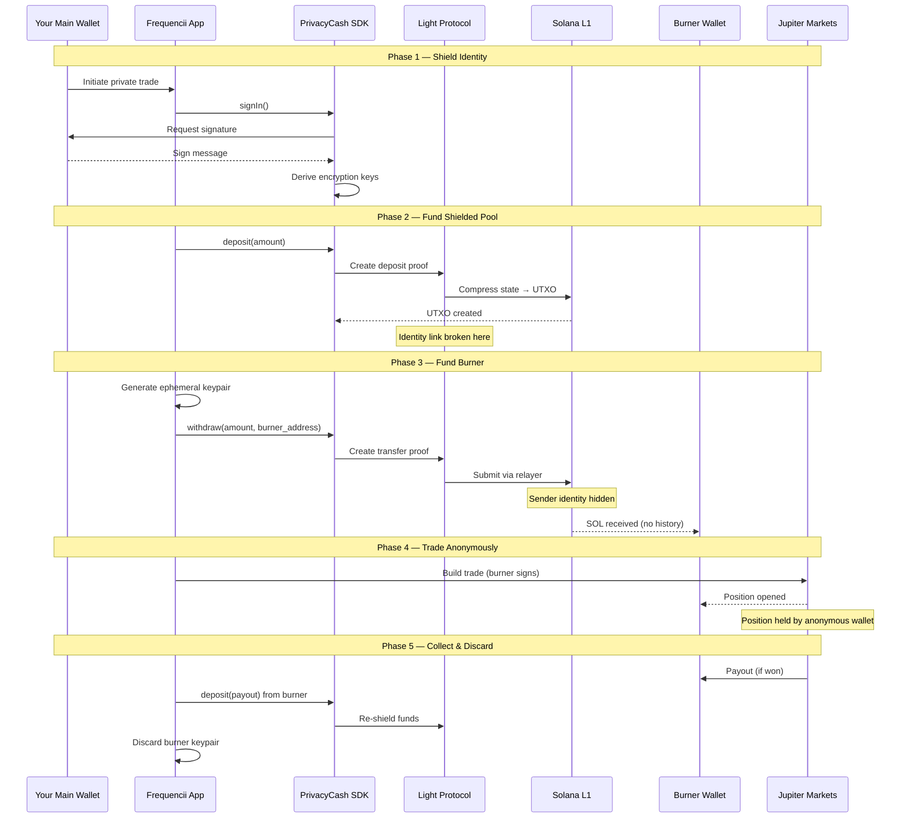
```mermaid
sequenceDiagram
    participant User as Your Main Wallet
    participant App as Frequencii App
    participant Privacy as PrivacyCash SDK
    participant Light as Light Protocol
    participant Solana as Solana L1
    participant Burner as Burner Wallet
    participant Jupiter as Jupiter Markets

    Note over User,Jupiter: Phase 1 — Shield Identity
    User->>App: Initiate private trade
    App->>Privacy: signIn()
    Privacy->>User: Request signature
    User-->>Privacy: Sign message
    Privacy->>Privacy: Derive encryption keys

    Note over User,Jupiter: Phase 2 — Fund Shielded Pool
    App->>Privacy: deposit(amount)
    Privacy->>Light: Create deposit proof
    Light->>Solana: Compress state → UTXO
    Solana-->>Privacy: UTXO created
    Note over Light: Identity link broken here

    Note over User,Jupiter: Phase 3 — Fund Burner
    App->>App: Generate ephemeral keypair
    App->>Privacy: withdraw(amount, burner_address)
    Privacy->>Light: Create transfer proof
    Light->>Solana: Submit via relayer
    Note over Solana: Sender identity hidden
    Solana-->>Burner: SOL received (no history)

    Note over User,Jupiter: Phase 4 — Trade Anonymously
    App->>Jupiter: Build trade (burner signs)
    Jupiter-->>Burner: Position opened
    Note over Jupiter: Position held by anonymous wallet

    Note over User,Jupiter: Phase 5 — Collect & Discard
    Jupiter->>Burner: Payout (if won)
    App->>Privacy: deposit(payout) from burner
    Privacy->>Light: Re-shield funds
    App->>App: Discard burner keypair
```

---

## AI Prediction Agent Architecture

### Agent Pipeline

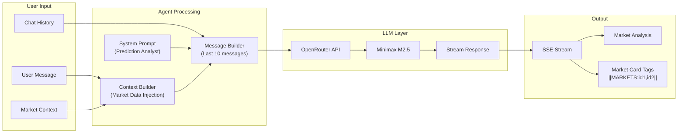
```mermaid
flowchart LR
    subgraph Input["User Input"]
        Message["User Message"]
        Context["Market Context"]
        History["Chat History"]
    end

    subgraph Processing["Agent Processing"]
        SystemPrompt["System Prompt\n(Prediction Analyst)"]
        ContextBuilder["Context Builder\n(Market Data Injection)"]
        MessageBuilder["Message Builder\n(Last 10 messages)"]
    end

    subgraph LLM["LLM Layer"]
        OpenRouter["OpenRouter API"]
        Model["Minimax M2.5"]
        Streaming["Stream Response"]
    end

    subgraph Output["Output"]
        SSE["SSE Stream"]
        Analysis["Market Analysis"]
        MarketTags["Market Card Tags\n||MARKETS:id1,id2||"]
    end

    Message --> ContextBuilder
    Context --> ContextBuilder
    History --> MessageBuilder
    SystemPrompt --> MessageBuilder
    ContextBuilder --> MessageBuilder
    MessageBuilder --> OpenRouter
    OpenRouter --> Model
    Model --> Streaming
    Streaming --> SSE
    SSE --> Analysis
    SSE --> MarketTags
```

### Agent Capabilities

| Capability | Description |
| :--- | :--- |
| **Market Analysis** | Breaks down YES/NO probabilities with reasoning |
| **Risk Assessment** | Confidence scoring (Low / Medium / High) |
| **Sentiment Reading** | Volume shifts, odds movement interpretation |
| **Factor Identification** | Key events that could shift outcomes |
| **Context Awareness** | Ingests current market or trending markets data |
| **Interactive Cards** | References markets via `\|\|MARKETS:id\|\|` tags for UI rendering |

### SSE Streaming Protocol

```
Client → POST /api/v1/agent/chat
         { message, marketContext?, trendingMarkets?, history? }

Server → text/event-stream
         data: {"content": "Based on...", "done": false}
         data: {"content": " current odds...", "done": false}
         ...
         data: {"done": true}
```

---

## API Architecture

### Authentication Flow

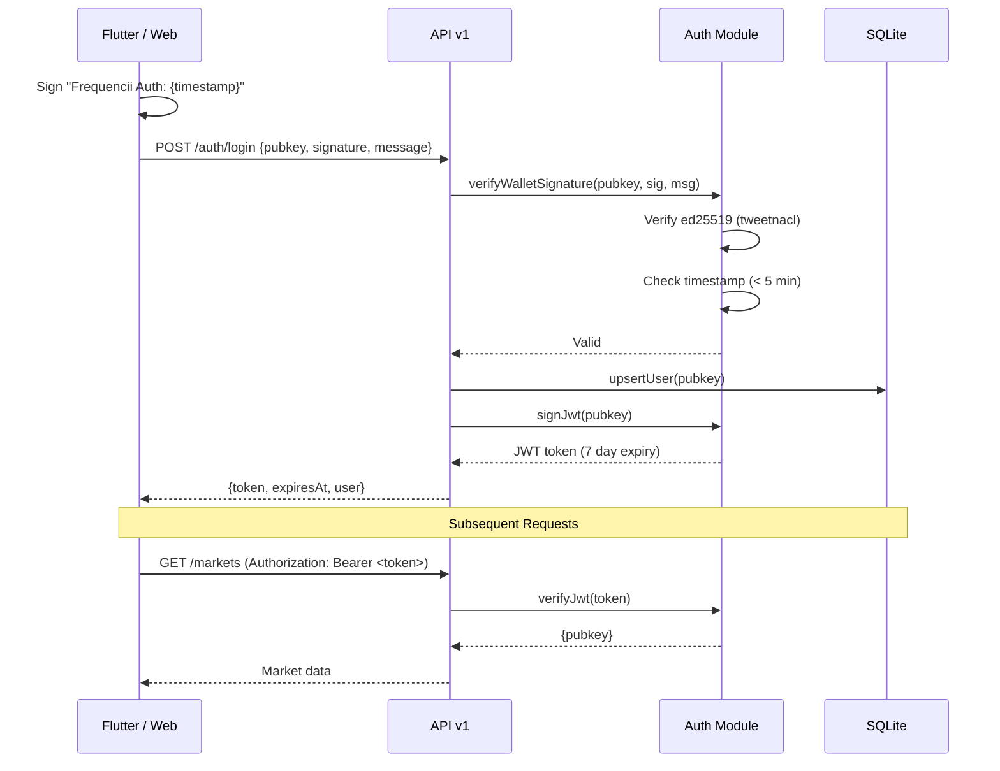
```mermaid
sequenceDiagram
    participant Client as Flutter / Web
    participant API as API v1
    participant Auth as Auth Module
    participant DB as SQLite

    Client->>Client: Sign "Frequencii Auth: {timestamp}"
    Client->>API: POST /auth/login {pubkey, signature, message}
    API->>Auth: verifyWalletSignature(pubkey, sig, msg)
    Auth->>Auth: Verify ed25519 (tweetnacl)
    Auth->>Auth: Check timestamp (< 5 min)
    Auth-->>API: Valid
    API->>DB: upsertUser(pubkey)
    API->>Auth: signJwt(pubkey)
    Auth-->>API: JWT token (7 day expiry)
    API-->>Client: {token, expiresAt, user}

    Note over Client,DB: Subsequent Requests
    Client->>API: GET /markets (Authorization: Bearer <token>)
    API->>Auth: verifyJwt(token)
    Auth-->>API: {pubkey}
    API-->>Client: Market data
```

### Endpoint Map

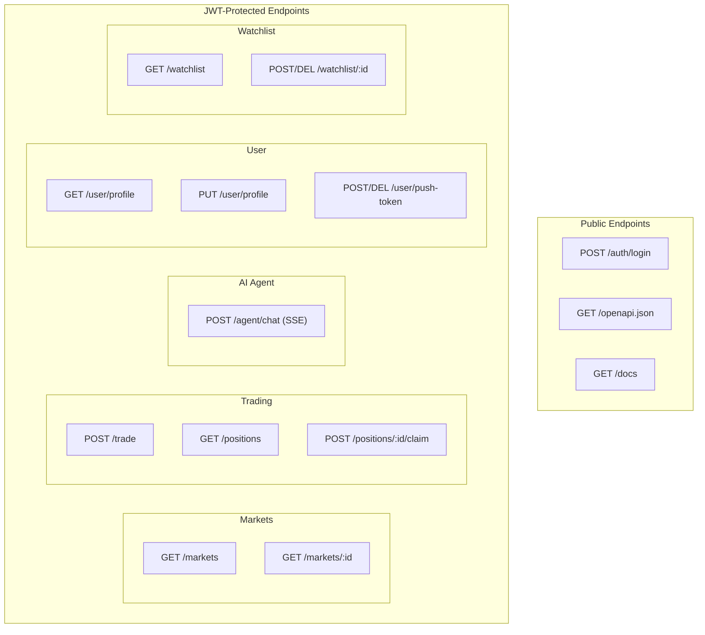
```mermaid
flowchart TB
    subgraph Public["Public Endpoints"]
        Login["POST /auth/login"]
        OpenAPI["GET /openapi.json"]
        Docs["GET /docs"]
    end

    subgraph Authenticated["JWT-Protected Endpoints"]
        subgraph MarketEndpoints["Markets"]
            ListMarkets["GET /markets"]
            GetMarket["GET /markets/:id"]
        end

        subgraph TradeEndpoints["Trading"]
            BuildTrade["POST /trade"]
            ListPositions["GET /positions"]
            ClaimPayout["POST /positions/:id/claim"]
        end

        subgraph AgentEndpoints["AI Agent"]
            Chat["POST /agent/chat (SSE)"]
        end

        subgraph UserEndpoints["User"]
            GetProfile["GET /user/profile"]
            UpdateProfile["PUT /user/profile"]
            PushToken["POST/DEL /user/push-token"]
        end

        subgraph WatchlistEndpoints["Watchlist"]
            ListWatchlist["GET /watchlist"]
            ManageWatchlist["POST/DEL /watchlist/:id"]
        end
    end
```

### Data Persistence

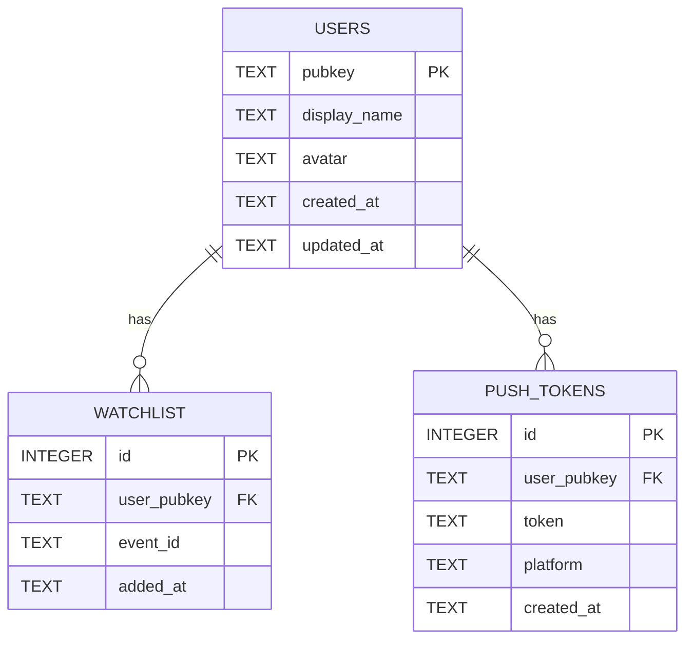
```mermaid
erDiagram
    USERS {
        TEXT pubkey PK
        TEXT display_name
        TEXT avatar
        TEXT created_at
        TEXT updated_at
    }

    WATCHLIST {
        INTEGER id PK
        TEXT user_pubkey FK
        TEXT event_id
        TEXT added_at
    }

    PUSH_TOKENS {
        INTEGER id PK
        TEXT user_pubkey FK
        TEXT token
        TEXT platform
        TEXT created_at
    }

    USERS ||--o{ WATCHLIST : has
    USERS ||--o{ PUSH_TOKENS : has
```

---

## P2P Chat Architecture

### Message Flow

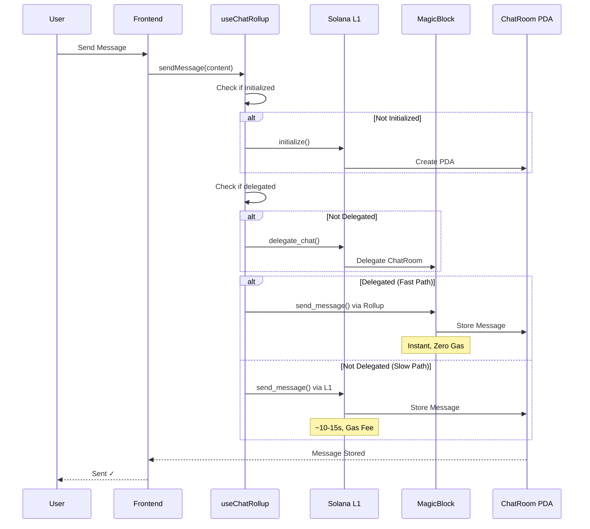
```mermaid
sequenceDiagram
    participant User as User
    participant Frontend as Frontend
    participant Hook as useChatRollup
    participant L1 as Solana L1
    participant MB as MagicBlock
    participant ChatRoom as ChatRoom PDA

    User->>Frontend: Send Message
    Frontend->>Hook: sendMessage(content)

    Hook->>Hook: Check if initialized

    alt Not Initialized
        Hook->>L1: initialize()
        L1->>ChatRoom: Create PDA
    end

    Hook->>Hook: Check if delegated

    alt Not Delegated
        Hook->>L1: delegate_chat()
        L1->>MB: Delegate ChatRoom
    end

    alt Delegated (Fast Path)
        Hook->>MB: send_message() via Rollup
        MB->>ChatRoom: Store Message
        Note over MB: Instant, Zero Gas
    else Not Delegated (Slow Path)
        Hook->>L1: send_message() via L1
        L1->>ChatRoom: Store Message
        Note over L1: ~10-15s, Gas Fee
    end

    ChatRoom-->>Frontend: Message Stored
    Frontend-->>User: Sent ✓
```

### Smart Contract

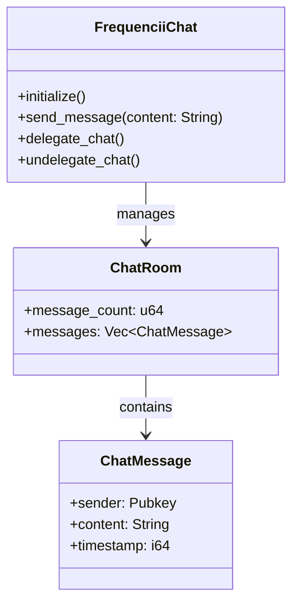
```mermaid
classDiagram
    class FrequenciiChat {
        +initialize()
        +send_message(content: String)
        +delegate_chat()
        +undelegate_chat()
    }

    class ChatRoom {
        +message_count: u64
        +messages: Vec~ChatMessage~
    }

    class ChatMessage {
        +sender: Pubkey
        +content: String
        +timestamp: i64
    }

    FrequenciiChat --> ChatRoom : manages
    ChatRoom --> ChatMessage : contains
```

---

## Private Gift Architecture

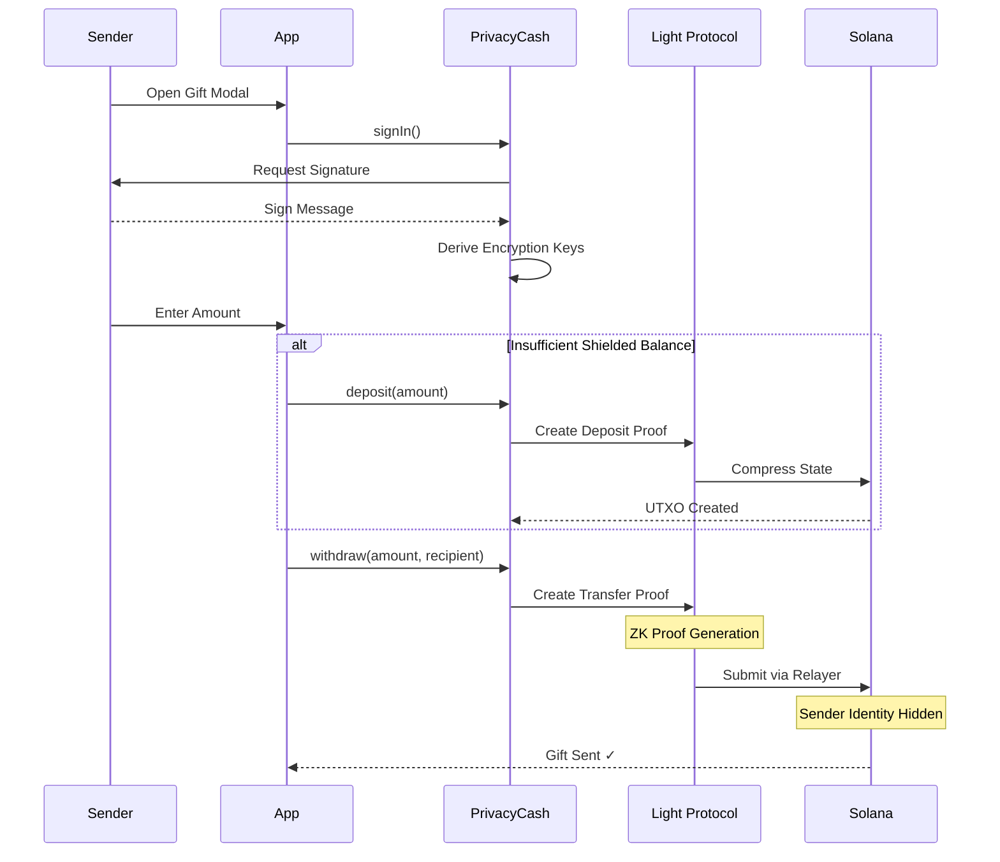
```mermaid
sequenceDiagram
    participant Sender as Sender
    participant App as App
    participant Privacy as PrivacyCash
    participant Light as Light Protocol
    participant Solana as Solana

    Sender->>App: Open Gift Modal
    App->>Privacy: signIn()
    Privacy->>Sender: Request Signature
    Sender-->>Privacy: Sign Message
    Privacy->>Privacy: Derive Encryption Keys

    Sender->>App: Enter Amount

    alt Insufficient Shielded Balance
        App->>Privacy: deposit(amount)
        Privacy->>Light: Create Deposit Proof
        Light->>Solana: Compress State
        Solana-->>Privacy: UTXO Created
    end

    App->>Privacy: withdraw(amount, recipient)
    Privacy->>Light: Create Transfer Proof
    Note over Light: ZK Proof Generation
    Light->>Solana: Submit via Relayer
    Note over Solana: Sender Identity Hidden
    Solana-->>App: Gift Sent ✓
```

---

## Security Model

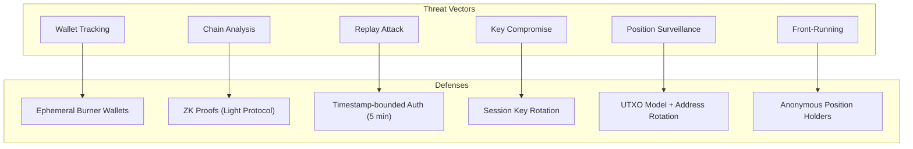
```mermaid
flowchart TB
    subgraph Threats["Threat Vectors"]
        T1["Wallet Tracking"]
        T2["Chain Analysis"]
        T3["Replay Attack"]
        T4["Key Compromise"]
        T5["Position Surveillance"]
        T6["Front-Running"]
    end

    subgraph Mitigations["Defenses"]
        M1["Ephemeral Burner Wallets"]
        M2["ZK Proofs (Light Protocol)"]
        M3["Timestamp-bounded Auth (5 min)"]
        M4["Session Key Rotation"]
        M5["UTXO Model + Address Rotation"]
        M6["Anonymous Position Holders"]
    end

    T1 --> M1
    T2 --> M2
    T3 --> M3
    T4 --> M4
    T5 --> M5
    T6 --> M6
```

---

## Performance Characteristics

| Metric | Chat (MagicBlock) | Trade (Jupiter) | Gift (PrivacyCash) |
|--------|-------------------|-----------------|-------------------|
| **Latency** | < 1s | 2-5s | 5-15s |
| **Gas Cost** | Free | Standard Solana | ~0.007 SOL |
| **Privacy** | Pseudonymous | ZK-Shielded | ZK-Shielded |
| **Throughput** | 1000+ msg/sec | Market-dependent | Proof-dependent |

---

## Resources

- [Jupiter Prediction API](https://station.jup.ag/docs)
- [Light Protocol](https://lightprotocol.com)
- [MagicBlock](https://magicblock.gg)
- [OpenRouter](https://openrouter.ai)
- [Solana Docs](https://solana.com/docs)

---

*Built on Solana — where privacy meets prediction.*
